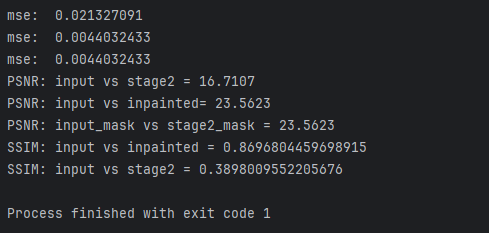

# Deepfillv2-prop: 구조 개선 기반 이미지 인페인팅 성능 향상 및 실증 구현

## 프로젝트 개요

Deepfillv2 기반 이미지 인페인팅 모델의 구조를 변형하여 성능을 향상시키고, 웹 환경에서 시연할 수 있도록 구현한 프로젝트입니다.
정량적 지표(PSNR, SSIM) 기준으로 기존 대비 **약 6%의 성능 개선**을 달성했습니다.

- **프로젝트 기간**: 2024.03 ~ 2024.12 (모델 연구) / 2026.07 ~ (웹 시연 전환)
- **팀원**: 2명 (이정훈 외 1명)
- **역할**: AI 모델링 / 실험 설계 / 시연 구현

---

## 주요 기능 및 개선 사항

- 기존 Deepfillv2 구조 분석 및 병목 구간 식별
- Contextual Attention 모듈 개선
- 다양한 마스크 형태(원형, 사각형, 자유곡선, 글자 모양 등) 생성 실험
- 정량 평가 지표(PSNR, SSIM) 기준 약 6% 성능 향상
- OpenCV GUI 시연 → **React + Spring Boot 웹 시연**으로 전환

---

## 모델 성능 평가

| 모델 | PSNR ↑ | SSIM ↑ |
|------|--------|--------|
| 기존 Deepfillv2 | 26.17 | 0.901 |
| 개선 모델 (Ours) | **27.75** | **0.929** |



에포크별 손실 곡선과 테스트 결과 이미지는 [`experiments/`](experiments/)에서 확인할 수 있습니다.

---

## 저장소 구조

```
├── frontend/     # React 시연 UI (이미지 업로드 + 마스크 드로잉)
├── backend/      # Spring Boot REST API (추론 서비스 프록시)
├── model/
│   ├── train/    # 학습·평가 유틸리티 (TensorFlow)
│   ├── masks/    # 마스크 형태 생성 실험 코드
│   └── serving/  # FastAPI 추론 서비스
├── demo/         # 초기 OpenCV GUI 시연 코드 (baseline / improved)
├── experiments/  # 학습 산출물 (손실 CSV, 결과 이미지, 점수)
└── docs/         # 문서·이미지
```

---

## 웹 시연 실행 방법

세 개의 서비스를 순서대로 실행합니다.

**1. 추론 서비스 (FastAPI, :8000)**

```bash
cd model/serving
python -m venv .venv && .venv/Scripts/activate   # 최초 1회
pip install -r requirements.txt                  # 최초 1회
uvicorn app:app --port 8000
```

학습 체크포인트(`training_checkpoints/`)가 있으면 DeepFillv2 모델로 추론하고,
없으면 OpenCV Telea 인페인팅으로 폴백해 데모 흐름을 확인할 수 있습니다.

**2. 백엔드 (Spring Boot, :8080)**

```bash
cd backend
./mvnw spring-boot:run
```

**3. 프론트엔드 (React + Vite, :5173)**

```bash
cd frontend
npm install    # 최초 1회
npm run dev
```

브라우저에서 `http://localhost:5173` 접속 → 이미지 업로드 → 지울 영역을 브러시로 칠하기 → **인페인팅 실행**.

---

## 기술 스택

- **모델**: TensorFlow 2 기반 Deepfillv2 (GeneratorMultiColumn) 커스터마이징
- **추론 서비스**: Python, FastAPI, OpenCV
- **백엔드**: Java, Spring Boot
- **프론트엔드**: React, Vite
- **시각화**: Matplotlib
- **협업 관리**: Git / GitHub (main ← dev ← backend·frontend ← feat/*)
